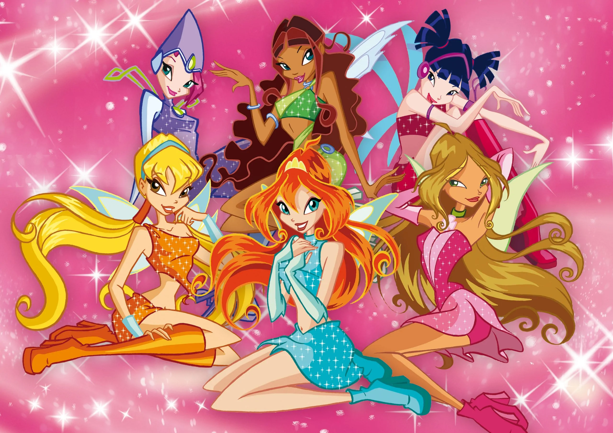

# Это мой язык феечек ВИНКС!!!!


##### Представляю ВАМ (кому же еще ) мой язык феечек Винкс, который был написан (возмножно очень плохо) в зачетную неделю (ладна, за неделю до зачетной недели, но все же...)

### Ключевые слова
#### Начнем с самого важного, какими вообще словами пользоваться, используя мой язык: (важное уточнение, цифры еще в доработке, так что юзаются обычные цифры и числа (лучше что-то, чем ничего))
```
'=' with
'*' energy
'+' harmony
'^' empower
'-' separate
'/' balance
'while' spell
'if' whisper

'1' Bloom
'2' Stella
'3' Muza
'4' Layla
'5' Tecna
'6' Flora
'7' Faragonda
'8' Darcy
'9' Riven
'0' Brendon
```
### Структура языка
________
```
в языке Си:
count = count + 1;

в языке феечек Винкс:
1 harmony count with count winx
то есть (переводя на язык Си):
1 + count = count;
```

